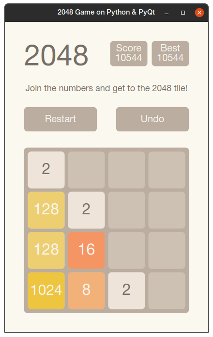

# 2048-PyQt
Based on popular game [2048](https://github.com/gabrielecirulli/2048) by Gabriele 
Cirulli. The game's objective is to slide numbered tiles on a grid to combine 
them to create a tile with the number 2048. Here is Python version that uses PyQt5.  

  

# Features
- Custom grid resolutions by changing following option  
(minimally supported is 4):
```ini
[Game]
grid = 4
```
- Save / load progress
- Animation support
- Adaptive window size

# Usage
Make sure you have installed [Git](https://git-scm.com/downloads), 
[Python3](https://wiki.python.org/moin/BeginnersGuide/Download) and
[pip3](https://pip.pypa.io/en/stable/) on your PC.  
Clone repository:
```
git clone https://github.com/dex359/2048-PyQt.git
```  
Change directory:
```
cd 2048-PyQt
```
Then install dependencies by following command:
```
pip3 install -r requirements.txt
```
To run:
```
python3 game.py
```
or click on 'game.py' in file explorer. On Linux you must before:
 ```
chmod +x game.py
```